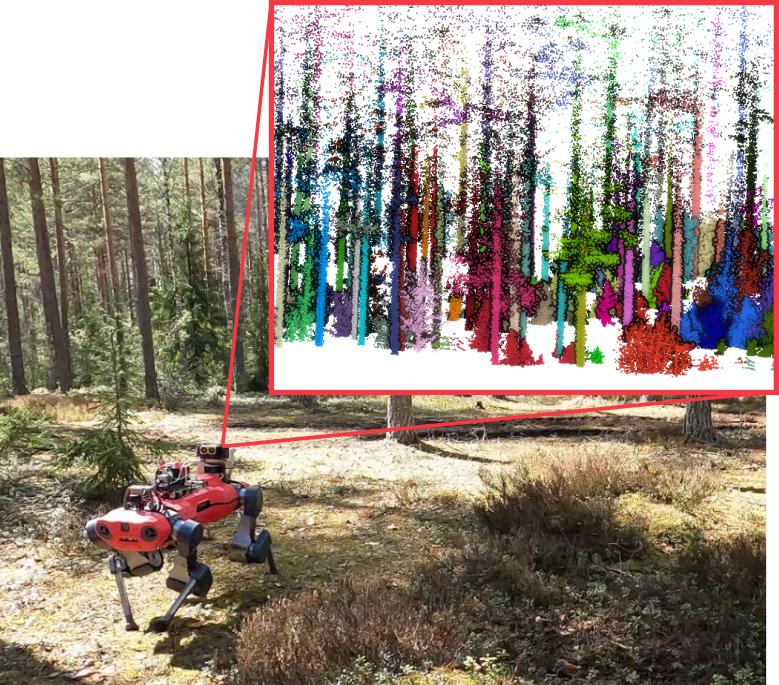

<div align="center">
  <h1>Tree Instance Segmentation and Traits Estimation for Forestry Environment Exploiting LiDAR Data Collected by Mobile Robots</h1>
    <a href="#setup"></a>
    <a href="#usage"></a>
    <a href="https://www.ipb.uni-bonn.de/pdfs/malladi2024icra.pdf">.svg?style=flat-square" /></a>
    <a href="https://lbesson.mit-license.org/"></a>

<p>
  
</p>

</div>


## Setup

A docker image is provided and details are described in the [Docker](#docker) section below.

### Dependencies

This code has been developed and tested on Ubuntu 22.04 LTS using Python 3.10.
Currently, we do not support Python 3.8, though it is planned.

System dependencies:

- libegl1 libgl1 libgomp1 (required by Open3D)

```bash
sudo apt install libegl1 libgl1 libgomp1
```

- build-essential (Gives g++ make libc among others)

```bash
sudo apt install build-essential
```

CMake is not needed to build the package. This is handled by the python build system.

### forest_inventory_pipeline

After you clone the repository, installing it is a simple

```bash
pip install -v .
```

or

```bash
make [install] # install is the default target
```

### Docker

Please check the `docker/` folder.
A simple Dockerfile is provided that sets up the project in a base Ubuntu 22.04 image.
A `compose.yaml` file is provided for convenience as well.
This also has services to run some different experiments on data.

You can run a container with `forest_inventory_pipeline` setup by running the following from inside `docker/`

```bash
docker compose run fip
```

## Usage

The CLI entrypoint `fip` covers most of the relevant information needed to use the package.
Additionally, parameters are described and their default values are given in corresponding files under `config/`.

```bash
fip --help
fip instance --help
fip dbh --help
```

Example runs:

```bash
# relevant output of the following is an instance_segmented_cloud.ply  
fip instance /data/input_cloud.ply --output /output -c config/instance.yaml
```

In case some stages have been run earlier, corresponding skip flags can be used.
```bash
# relevant output of the following is cylinders.pickle and tree_dbh.csv
fip dbh /data/input_cloud.ply --output output -c config/dbh.yaml --skip_gs --skip_norm --skip_cluster 
```

If the `--output` flag is specified, only then do results get written to disk.

### Example Experiments

To test and use the approach, you can use the provided Docker image and some simple experiment scripts in `scripts/evaluation`.
These scripts need the data in a slightly specific format detailed further in their documentation (use `--help` when running the cli).

Unfortunately, the data used for the paper was collected in context of the DigiForest EU project and is under NDA.
This data is not yet released.
However, it is planned to soon make a labeled forestry dataset release under the DigiForest project which this repository will also then support.
This dataset is expected to be released latest by October 2024.
Apologies for the inconvenience.

To run an instance segmentation experiment, `cd` into the `docker/` folder, modify the `compose.yaml` file to have the appropriate data mount, and then run:

```bash
docker compose run fip_instance
```

The results will get printed to the console.

To run a DBH estimation experiment, `cd` into the `docker/` folder and then run:

```bash
docker compose run fip_dbh
```

## Publication

If you use our code in your academic work, please cite the corresponding [paper](https://www.ipb.uni-bonn.de/pdfs/malladi2024icra.pdf):

```
@inproceedings{malladi2024icra,
  author = {M.V.R. Malladi and T. Guadagnino and L. Lobefaro and M. Mattamala and H. Griess and J. Schweier and N. Chebrolu and M. Fallon and J. Behley and C. Stachniss},
  title = {{Tree Instance Segmentation and Traits Estimation for Forestry Environments Exploiting LiDAR Data Collected by Mobile Robots}},
  booktitle = icra,
  year = 2024,
  codeurl = {https://github.com/PRBonn/forest_inventory_pipeline}
} 
```

## License

This project is free software made available under the MIT license. For details, see the [LICENSE](LICENSE) file.